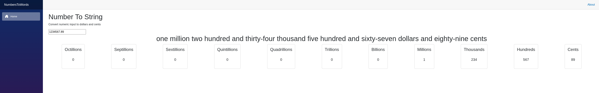

Running the solution:

# Requirements: 
Dotnet 10 SDK
Chromium based browser (if debugging)

# Running this project
`git clone https://github.com/StickMick/NumbersToWords.git`

`dotnet run --project ./NumbersToWords/NumbersToWords/NumbersToWords.csproj `

# Running Tests
`dotnet test`

Chosen Approach:
Stack:
Using blazor so you don't need to deal with a massive pile of NPM dependencies, just raw c# the whole way down.

Logic:
I have never grinded leetcode, all my AI integrations are turned off, I'm not looking up any information.
I could probably make a nice, elegant solution given time...but instead I plan to just have some fun.

I think it would be fun for the UI to give a visual of how the logic is parsing the numbers.
I made an interpreter/lexer/parser in the past for a particular business requirement. It was fun, and in that I made a visual indicator of how the interpreter was processing the input.
That was considerably more complex than I imagine this will be, since it would need to evaluate various structures in particular orders...but let's see what I can put together for this.

-----------------

Technical Test – Developer Candidates
Number to Words Web Page
Please develop a web page featuring a web server routine that accepts a numerical input, converts the
number into words, and returns the result as a string output parameter.
The web page should provide a simple, user-friendly interface where a user can enter a numerical value,
submit it for processing, and view the resulting number in words. The solution should demonstrate both
the functionality of the server-side routine and how the web interface interacts with it.
IO example:
Input: “123.45”
Output: “ONE HUNDRED AND TWENTY-THREE DOLLARS AND FORTY-FIVE CENTS”
Deliverables
• An HTML web interface that allows the solution to be tested interactively.
• A design document outlining your chosen approach, including why you selected it and why you
rejected alternative solutions.
• A test plan covering how you have tested your solution.
• Supporting testing files, such as a working executable (where applicable), source code, test
harnesses, configuration and test data, and solution or project files.
• The solution should be implemented using C# (preferred) or Java.
• A README.md containing clear instructions on how to build, host and interact with your solution.
Submission Requirements
1. Quality of work
   Produce the quality of work and user interface that you would consider acceptable for a
   customer.
2. AI usage
   While we do use AI in our development process at TechnologyOne, we ask that you do not use AI
   when completing this technical test. We are assessing your own ability to write clean,
   readable, extensible and maintainable code that is sufficiently covered by tests.
3. Internet and existing solutions
   Please do not use the internet to find part or all of the solution. We are familiar with common
   solutions available online and want to assess your own analysis, design and coding skills.
4. Libraries and packages
   Please develop your own solution and algorithm without using existing libraries or NuGet
   packages to solve the core requirements of the exercise.
5. Submission
   Please complete and submit the attached exercise within 3 days of receiving. Upload your
   completed exercise to a public GitHub repository, Google Drive, Dropbox or similar platform and
   provide the relevant link. As there will be multiple people reviewing the exercise, the submission
   needs be accessed by everyone involved in the assessment process